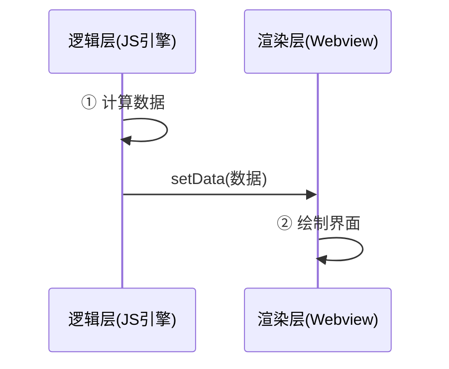

为什么不用官方的虚拟列表（如 recycle-view）？我试过虚拟列表方案，但滚动时会有item闪烁问题。

折腾了半天发现原因是小程序双线程的处理速度差导致的。逻辑层计算数据飞快，但渲染层绘制跟不上，导致节点复用来不及执行，视觉上就是闪白和抖动。

在 H5 开发中，我们习惯通过监听 `onScroll` 事件，根据滚动位移实时计算并更新 DOM 节点。

但在微信小程序中，由于逻辑层JS与视图层Webview的双线程架构，频繁滚动通信会导致 `setData` 积压，造成白屏和卡顿。

简单画个图：



逻辑层(算数据)  --setData-->  渲染层(画界面)

### 实现思路

利用原生提供的 **IntersectionObserver** 实现 **分段渲染**。

首先将成百上千条的扁平数据按固定数量（如10条一组）切分为多个块，在页面上对应渲染出一系列块容器锚点。

仅监听这些块容器与视口的交叉状态，设置一个约 600px 的缓冲区，当块容器进入缓冲区时，利用 `v-if` 触发 DOM 的挂载。

当其滑出缓冲区时，立即销毁内部节点以释放内存。

为了防止滚动条在内容销毁后发生抖动或塌陷，动态记录每一个块在渲染时的真实高度并缓存到映射表中，卸载后通过 `min-height` 进行物理占位。

---

#### 1\. 数据分块

用 `computed` 分块，将大数组渲染转化为多个分片渲染。

```vue
// 计算拿到分块数组
const chunkedList = computed(() => {
  const chunks = []
  for (let i = 0; i < list.length; i += chunkSize) {
    chunks.push({ id: i / chunkSize, items: list.slice(i, i + chunkSize) })
  }
  return chunks
})
```

#### 2\. 状态监听

传统的 `onScroll` 方案需要从视图层向逻辑层高频同步 `scrollTop`，造成双线程通信拥塞。

而 `IntersectionObserver` 运行在原生渲染层，仅在达到触发条件时回调一次，极大地节省了 CPU 开销。

```vue
const visibleMap = ref({}) // 记录块的可视性
const heightMap = ref({})  // 记录块的高度
const instance = getCurrentInstance()
let observer = null

// 启动监测
const startObserver = () => {
  if (observer) observer.disconnect()
  // observeAll: true 允许同时监听所有符合条件的 .chunk-anchor
  observer = uni.createIntersectionObserver(instance.proxy, { observeAll: true })
  
  // 设置合适的缓冲区大小，让节点在进入视口前提前开始渲染
  observer.relativeToViewport({ top: 600, bottom: 600 })
    .observe('.chunk-anchor', (res) => {
      const { id } = res.dataset
      const isIntersecting = res.intersectionRatio > 0
      
      // 更新可见性
      visibleMap.value[id] = isIntersecting
      
      // 当块进入视口渲染完成后，立即捕捉真实高度并缓存
      if (isIntersecting && res.boundingClientRect.height > 0) {
        heightMap.value[id] = res.boundingClientRect.height
      }
    })
}
```

#### 3\. 模板占位

使用 `min-height` 解决长列表优化中的非固定高度导致的页面塌陷问题。

```vue
<template>
  <scroll-view class="scroll-container" scroll-y @scroll="$emit('scroll', $event)">
    <view 
      v-for="chunk in chunkedList" 
      :key="chunk.id"
      :data-id="chunk.id"
      class="chunk-anchor"
      :style="{ 
        /** 
         * 当块可见时，设为 auto 让内部元素撑开
         * 当块销毁时，使用 heightMap 记录的真实高度或 estimatedSize 初始预估高度进行物理占位
         */
        minHeight: visibleMap[chunk.id] ? 'auto' : (heightMap[chunk.id] || estimatedSize) + 'px' 
      }"
    >
      <template v-if="visibleMap[chunk.id]">
        <view v-for="item in chunk.items" :key="item[itemKey]">
          <slot name="list-item" :item="item" />
        </view>
      </template>
    </view>
  </scroll-view>
</template>
```

---

显隐判断由小程序原生层处理，不依赖逻辑层的 `onScroll` 计算。

滑出视口的块会被销毁，即使有数千个节点，页面始终只保持几十个真实 DOM 节点，极大降低内存占用。

由于有缓冲区预渲染，用户几乎感知不到 DOM 的动态加载。

通过 `heightMap` 自动记录块渲染后的真实高度，解决由于项高度不固定导致的滚动条跳动问题。