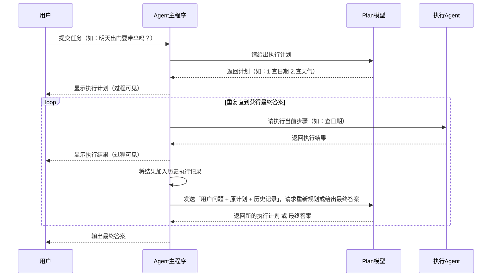

# 什么是 Agent？

常规大模型无法感知和干预外界，只能进行普通交流对话。而能够自己思考、自动调用大模型、调用工具的，就叫作 **Agent**。

---

## Agent 的运行模式：ReAct

**ReAct** 即 **Reasoning and Acting**，主要流程如下：

1. 用户提交任务  
2. Agent 进行**思考（Thought）**  
3. 如果需要调用工具，则进行**行动（Action）**  
4. **观察（Observation）** 工具调用结果 
5. 再次思考是否已得出答案  
6. 重复以上阶段，直到思考得出正确答案  

### 示例

> **用户问**：今天天气如何？  
> - **Agent 思考（Thought）**：我需要搜索今天的天气情况，可以调用天气检索工具。  
> - **Agent 行动（Action）**：调用 `get_weather()`  
> - **Agent 观察（Observation）**：得到结果为“今天天气晴朗”  
> - **新一轮 Agent 思考（Thought）**：检索结果已显示天气情况，我已得到答案。  
> - **Agent 输出最终答案（Final Answer）**：今天天气晴朗

---

### ReAct 运行时序图

**用户**：写一个番茄时钟 

① **Agent 主程序**：请求模型 → **模型** 

② **用户** ← **Agent 主程序**：显示 `thought + action` ← **模型**：返回 `thought + action` 

③ **Agent 主程序**：请求 `action` 对应的工具 → **工具** 

④ **用户** ← **Agent 主程序**：显示执行结果 ← **工具**：返回执行结果  

每次执行完 ①②③④ 后，将工具执行结果加入到历史消息列表中。 
重复执行 **n** 次，直到模型认为任务已完成，则：  

- **Agent 主程序**：请求模型 → **模型**  

- **用户** ← **Agent 主程序**：显示 `thought + final_answer` ← **模型**：返回 `thought + final_answer`

  ```mermaid
  sequenceDiagram

      用户->>Agent主程序: 提交任务（如：写一个番茄时钟）
      loop 重复直到模型认为任务完成
          Agent主程序->>大模型: 请求模型推理
          大模型-->>Agent主程序: 返回 thought + action
          Agent主程序-->>用户: 显示 thought + action（过程可见）
          alt 需要调用工具
              Agent主程序->>工具: 请求执行 action（如 get_weather()）
              工具-->>Agent主程序: 返回执行结果（observation）
              Agent主程序-->>用户: 显示执行结果（过程可见）
              Agent主程序->>Agent主程序: 将 observation 加入历史消息列表
          else 无需调用工具
              Note over Agent主程序: 准备输出最终答案
          end
      end
      Agent主程序->>大模型: 请求最终推理（含历史）
      大模型-->>Agent主程序: 返回 thought + final_answer
      Agent主程序-->>用户: 显示最终答案
  ```

---

## Plan-and-Execute 模式

另一种由 LangChain 提出的模式：**先规划，再执行**，即在执行前先规划好 TODO 列表。

### 运行时序图

**用户**：明天出门要带伞吗？ 

**Agent 主程序**：请给出执行计划 → **Plan 模型** 

**Agent 主程序** ← **Plan 模型**：执行计划如下： 

&emsp;1. 查询明天日期 

&emsp;2. 查询对应日期的天气  

① **Agent 主程序**：请执行第一步 → **执行 Agent**（独立的一个 Agent，这里不关心其运行模式或内置工具） 

② **Agent 主程序** ← **执行 Agent**：执行完毕，结果如下：... 

③ **Agent 主程序**：请给出一个新的执行计划（或可能已是最终答案）→ **Re-Plan 模型**（也可以是同一个 Plan 模型） 

④ **Agent 主程序** ← **Re-Plan 模型**：新的执行计划如下：...（或最终答案）  

同样重复执行 **n** 次 ①②③④，每次执行完后都将执行结果加入到历史执行记录中，然后将 **用户问题 + 执行计划 + 历史执行记录** 发给 Re-Plan 模型，直到模型获得最终答案。



