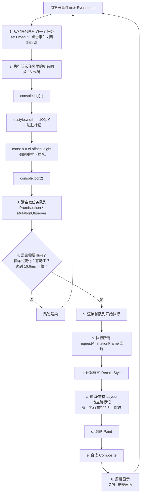

问题发生的背景是一个横向滚动的 `scroll-view` 列表，在第一次进入渲染该列表组件没问题，但切页回来组件就莫名消失了，这里其实是高度坍塌成 0 了。

## 错误代码

```vue
<template>
  <scroll-view class="option-list" scroll-x scroll-with-animation :show-scrollbar="false">
    <view
      class="option-text"
      v-for="(option, index) in options"
      :id="xxx"
      :key="xxx"
    >
      <!-- ... -->
    </view>
  </scroll-view>
</template>

<style lang="scss" scoped>
.option-list {
  width: 100%;
  white-space: nowrap;
  //...
}
.option-text {
  display: inline-block;
  //...
}
</style>
```

---

## 原因分析

在 `Uni-app` 中，`scroll-view` 不像 `<view>` 那样内容多了会自动撑开，它需要一个明确的尺寸约束，否则高度可能就是 0，或者被父元素挤得没空间。

列表项全是 `inline-block` 元素，横向排列用 `white-space: nowrap` 让子元素都脱离块级流，整个 `scroll-view` 的高度完全依赖浏览器去测量这些内联内容。

页面切走再切回来时，原生 `scroll-view` 不会重新测量里面的内联内容，而内联元素的高度本来就要靠布局引擎测量，它不量了，所以高度就塌成 0 了。

---

## 什么叫让子元素脱离块级流？

普通的块级元素都会遵循垂直排列，即一个块级盒子占一整行。

如果脱离了块级流排列，元素就不会再占据原来的空间位置，位置和尺寸由其他的定位机制来决定。

常见的方式除了以上这种父级容器 `white-space: nowrap` + 子元素 `display: inline-block` 以外，常见的脱离块级流排列方法还有以下几种。

1. 父元素 `display: contents`。
2. 子元素都设置 `float` 属性。
3. 父元素设为 `flex` 或 `grid` 布局。
4. 父元素相对定位作为锚点，子元素绝对定位脱离文档流。

---

## 为什么 `scroll-view` 重新渲染时不会重新测量高度？

在布局引擎中，每个节点都有一个脏标记，表示是否需要重新测量布局。

`Vue` 的 `computed` 机制就和这个十分相似，数据改变时，不立即重新计算，而是标记为脏数据，等下次访问再重新计算。

浏览器的布局引擎在元素尺寸改变时，不会立刻重排(重新计算布局)，而是把重排任务推入渲染帧队列里等待执行。

(如果此时 JS 中突然执行了对元素 `offsetHeight` 或 `clientHeight` 等布局属性的访问，浏览器发现有脏数据 => 立即中断 JS 执行 => 立刻原地执行重排 => 返回数值给 JS，这个就是“强制回流”。)

当页面切回时，引擎会遍历节点树，只有被打上脏标记的节点才会重新测量子元素。

而 `scroll-view` 的高度来自外部约束，比如 `height: 500px` 或 `flex: 1`。

切回时，这个外部约束的值完全没有变化，`scroll-view` 节点不会被标记为脏，引擎就不会去重新遍历计算子元素布局。

所以解决办法就是给 `scroll-view` 添加显式高度，不依赖内容撑开，就可以解决页面切回时高度坍塌的问题。

如果容器内部是普通块级元素撑起的高度，比如 `<view>`，就不会有高度坍塌问题，因为它的高度必须由子元素决定，即使父容器自身不脏，引擎在计算父容器高度时，也会强制向下遍历计算子元素高度，因为不问就算不出父容器自己的高度。

---

## 那为什么容器内部是行内块(inline-block)元素撑起的高度就会导致高度坍塌呢？

块级元素的高度 = 所有子元素高度之和。引擎要算出父容器高度，必须主动遍历所有子元素。

`inline-block` 的高度 != 自己的子元素高度之和。它在一个内联格式化上下文(IFC)中，最终高度受当前行的 `line-height`、`font-size`、`vertical-align` 以及同行其他元素的共同影响。引擎无法单独算出它的精确高度，必须等整行的`行内盒子 Line Box` (文本、span、img等)计算完成才能确定。

所以当页面切回时，`scroll-view` 的外部高度约束没变 => 自身没被标记为脏 => 引擎跳过了 `inline-block` 子元素的整行布局计算 => `scroll-view` 高度坍塌。

---

这里贴一张 Event Loop 流程图：



纯文本流程图：

```text
┌─────────────────────────────────────────────────────────────┐
│                    浏览器事件循环（Event Loop）              │
└─────────────────────────────────────────────────────────────┘
                              │
                              ▼
        ┌─────────────────────────────────────────┐
        │  1. 从宏任务队列（Task Queue）取一个任务  │
        │     例如：setTimeout、点击事件、网络回调   │
        └─────────────────────────────────────────┘
                              │
                              ▼
        ┌─────────────────────────────────────────┐
        │  2. 执行该宏任务里的所有同步 JS 代码      │
        │     ┌─────────────────────────────┐     │
        │     │  console.log(1)              │     │
        │     │  el.style.width = '100px'   │     │ ← 贴脏标记
        │     │  const h = el.offsetHeight  │     │ ← 强制重排（插队）
        │     │  console.log(2)              │     │
        │     └─────────────────────────────┘     │
        └─────────────────────────────────────────┘
                              │
                              ▼
        ┌─────────────────────────────────────────┐
        │  3. 清空微任务队列（Microtask Queue）    │
        │     执行所有的 Promise.then、MutationObserver │
        └─────────────────────────────────────────┘
                              │
                              ▼
        ┌─────────────────────────────────────────┐
        │  4. 是否需要渲染？（浏览器决定）          │
        │     - 有样式变化？                       │
        │     - 有动画？                          │
        │     - 是否达到 16.6ms 一帧？            │
        └─────────────────────────────────────────┘
                              │
                    是        ▼        否
              ┌──────────────────────────────┐   ┌─────────┐
              │  5. 【渲染帧队列】开始执行     │   │ 跳过渲染 │
              │  ┌──────────────────────────┐ │   │ 回到步骤1 │
              │  │ a. requestAnimationFrame │ │   └─────────┘
              │  │    （所有 rAF 回调）      │ │
              │  ├──────────────────────────┤ │
              │  │ b. 计算样式（Recalc Style）│ │
              │  ├──────────────────────────┤ │
              │  │ c. 布局/重排（Layout）    │ │ ← 检查脏标记
              │  │   如果有脏标记 → 执行重排  │ │   如果没有 → 跳过
              │  ├──────────────────────────┤ │
              │  │ d. 绘制（Paint）          │ │
              │  ├──────────────────────────┤ │
              │  │ e. 合成（Composite）      │ │
              │  └──────────────────────────┘ │
              └──────────────────────────────┘
                              │
                              ▼
        ┌─────────────────────────────────────────┐
        │  6. 屏幕显示（GPU 提交画面）             │
        └─────────────────────────────────────────┘
                              │
                              ▼
                   回到步骤 1（下一个宏任务）
```

---
